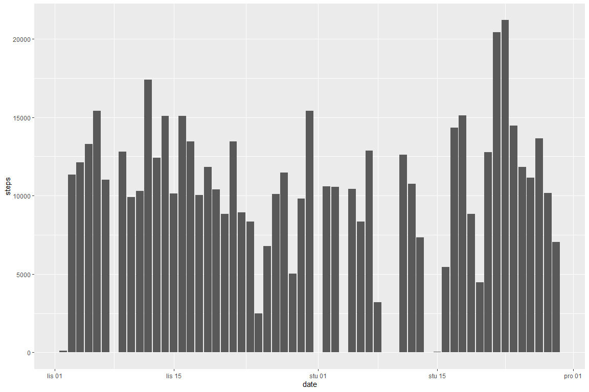
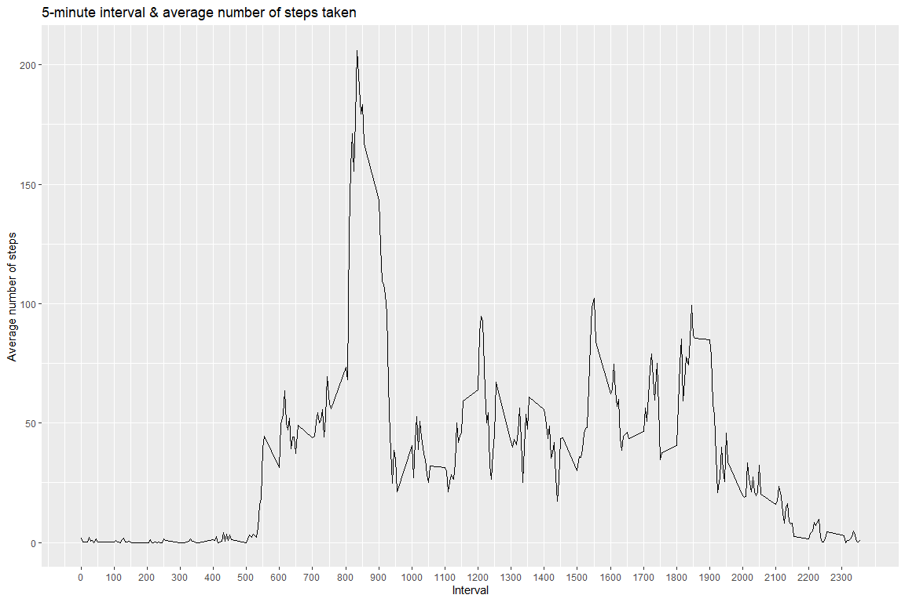
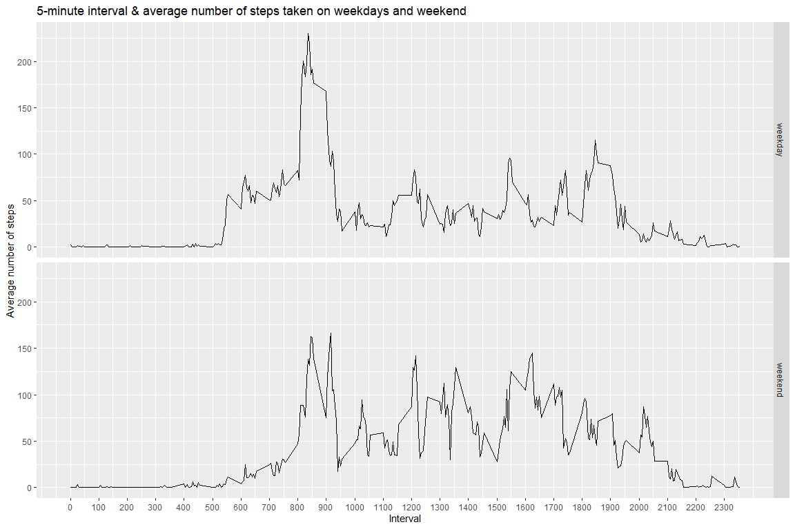

## Loading and preprocessing the data

We start by unpacking csv file and assinging it to the dataset **activity**. Then we convert **date** column to date class.


```r
unzip("activity.zip")
activity <- read.csv("activity.csv")
activity$date <- as.Date(as.character(activity$date))
```


## What is mean total number of steps taken per day?

This histogram shows **total number of steps** for each day of measuring period.


```r
agg <- aggregate(steps ~ date, activity, sum)
library(ggplot2)
ggplot(agg, aes(date,steps))+geom_histogram(stat="identity")
```

<!-- -->

Next, we calculate **mean**


```r
mean(agg$steps)
```

```
## [1] 10766.19
```

and ***median*** of the total number of steps taken per day.


```r
median(agg$steps)
```

```
## [1] 10765
```


## What is the average daily activity pattern?

The time series plot shows average number of steps taken averaged across all days on **5-minute interval**. It seems that maximum nuber of steps is made at interval of **830-835**.


```r
act1 <- aggregate(steps ~ interval, activity, mean)
ggplot(act1, aes(interval,steps)) + geom_line() + scale_x_continuous(breaks=seq(0,2355,100)) + labs(title = "5-minute interval & average number of steps taken", x="Interval", y="Average number of steps")
```

<!-- -->


## Imputing missing values

Now we calculate number of **missing cases(rows)**.


```r
sum(is.na(activity))
```

```
## [1] 2304
```

There is **2304** missing cases.

We make copy of original dataset.

```r
activity1 <- activity
activity1$date <- as.Date(as.character(activity1$date))
```

And then we **impute NAs with mean** of 5 minute interval each day.


```r
activity1$steps <- ifelse(is.na(activity1$steps), act1$steps, activity1$steps)
```

Next, we make **histogram** of the total number of steps taken each day with this new dataset that has no NAs.


```r
agg1 <- aggregate(steps ~ date, activity, sum)
ggplot(agg1, aes(date,steps))+geom_histogram(stat="identity")
```

<!-- -->

This histogram shows **no difference** to original one, based solely on visual inspection.
We calculate **mean and median** of imputed dataset.


```r
mean(agg1$steps)
```

```
## [1] 10766.19
```

```r
median(agg1$steps)
```

```
## [1] 10765
```

Again, figures seems the same in both datasets.


## Are there differences in activity patterns between weekdays and weekends?

For this task, first we define day of the week for all dates using **weekdays()** function. We will use dataset with imputed NAs.


```r
activity1$day <- weekdays(as.Date(activity1$date))
```

Next, we make factor variable that divides our dataset on **weekdays and weekend days**.


```r
activity1$daytype <- ifelse(weekdays(activity1$date) %in% c("subota", "nedjelja"), "weekend", "weekday")
```
***Note: I've used names of the days for my country, otherwise the code wouldn't work.***

And at last we make time series plot shows average number of steps taken on weekdays and weekend days.


```r
act2 <- aggregate(steps ~ interval + daytype, activity1, mean)
ggplot(act2, aes(interval,steps)) + geom_line() + facet_grid(daytype ~ .) + scale_x_continuous(breaks=seq(0,2355,100)) + labs(title = "5-minute interval & average number of steps taken on weekdays and weekend", x="Interval", y="Average number of steps")
```

<!-- -->

On weekdays it seems that more steps are taken earlier in a day vs. weekend when most of the steps were taken later in the day. So yes, **there is a difference** in steps count between weekdays and weekend.


